# Cook Book

Cook Book is a site for all gourmets and people who love to cook, share,try new recipes and delicious food. Cook Book offers the user a quick and effective way to get the desired specific recipe in the fastest possible way.

[View the live project here.](https://flask-cook-book-project.herokuapp.com/)

- [UX](#ux)
  * [Goals](#goals)
  * [User Stories](#user-stories)
    + [New Users](#new-users)
    + [Registered Users](#registered-users)
  * [Design Choices](#design-choices)
    + [Fonts](#fonts)
    + [Icons](#icons)
    + [Colours](#colours)
    + [Styling](#styling)
  * [Wireframes](#wireframes)
    + [Entity Relationship Diagram](#entity-relationship-diagram)
- [Features](#features)
  * [Existing Features](#existing-features)
    + [Home Page](#home-page)
    + [Navigation Bar](#navigation-bar)
    + [Search Bar](#search-bar)
    + [Parallax](#parallax)
    + [Floating Action Button](#floating-action-button)
    + [Quick Log In](#quick-log-in)
    + [Recipe Cards](#recipe-cards)
    + [Log In / Register Page](#log-in---register-page)
    + [My Recipes](#my-recipes)
    + [Add Recipe](#add-recipe)
    + [Footer](#footer)
  * [Features Left to Implement](#features-left-to-implement)
- [Technologies Used](#technologies-used)
- [Testing](#testing)
- [Deployment](#deployment)
  * [Cloning the Repository](#cloning-the-repository)
  * [Working with a Local Copy](#working-with-a-local-copy)
  * [Heroku Deployment](#heroku-deployment)
- [Credit](#credit)
  * [Content](#content)
    + [Recipes](#recipes)
  * [Acknowledgements](#acknowledgements)
  * [The content of this website is for educational purposes only.](#the-content-of-this-website-is-for-educational-purposes-only)

## UX

### Goals

The central target audience for Cook Book are people:

- Who are old enough to be able to use household appliances on their own, who possess a certain level of skill to operate this type of tool.
- Who likes to share recipes and knowledge about food and be part of this type of community.

User Goal is:

- Find a recipe in the fastest possible way less clicks possible.
- Find important information about the recipe without too much looking.
- Share recipes with the community. 

Cook Book is a great way to help users meet these needs because:

- The planning and design process took all these needs into account before starting to build it.
- The needs of the user may vary and vary from person to person and this site tries to cover some of the most important issues that the user has when visiting this site such as: 
    - Preparation time
    - Time need to cook a dish
    - Size of dish
    - Recipe difficulty
    - Recipe card showing recipe preparation time, recipe cooking time,   recipe size and recipe difficulty :

        

- Cook Book allows registered users to share their best creations with the community in form of CRUD operations (create, read, update, delete)

### User Stories

#### New Users

- As a new user, I want to be able to view recipes to cook.
- As a new user, I want to be able to search for recipes.
- As a new user, I want to be able easily navigate through the website. 
- As a new user, I want to be able to easily access all of its feature.
- As a new user, I want to be able to immediatly see what the website is about.
- As a new user, I want to be able to see different categories of recipes.
- As a new user, I want to be able to know cook time, portion size, allergens or difficulty of dish. 
- As a new user, I want to be able to see whole recipe on separate page
- As a new user, I want to be able to see ingredients needed for dish.
- As a new user, I want to be able to see image of dish.
- As a new user, I want to be able to create account.

#### Registered Users

- As a returning user, I want to be able to log in to my account easily.
- As a registered user, I want to be able to create my recipe.
- As a registered user, I want to be able to see my recipes.
- As a registered user, I want to be able to update my recipe.
- As a registered user, I want to be able to share my recipes.
- As a registered user, I want to be able to rate recipes.
- As a registered user, I want to be able to see feedback about my recipes.
- As a registered user, I expect my personal details to be private.
- As a registered user, I want to be able to delete my account.

### Design Choices

#### Fonts

Two fonts were used in this project.

- [Pacifico](https://fonts.google.com/specimen/Pacifico)
    - The Pacifico font is used for document headers because it resembles a handwritten one, and the page gets the impression of a book.
    
- Combined with a decorative divider they give a pleasant view.

    

- And it fits nicely into the darkened hero image.

    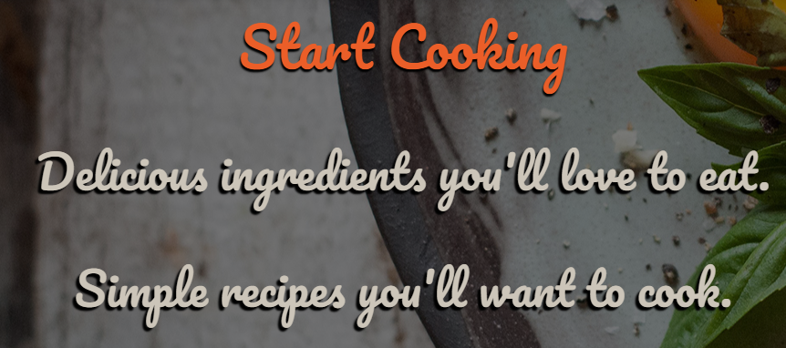

- [Roboto](https://fonts.google.com/specimen/Roboto?query=Roboto)
    - The robot font was chosen for the readability of the text. It is used primarily to display recipe ingredients and recipe methods.
    - Recipe ingredients :

        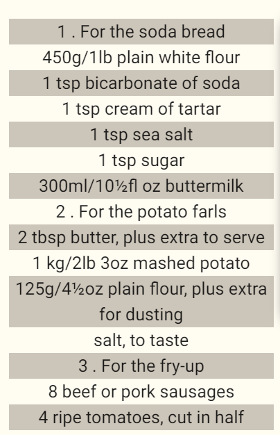

    - Recipe method :

        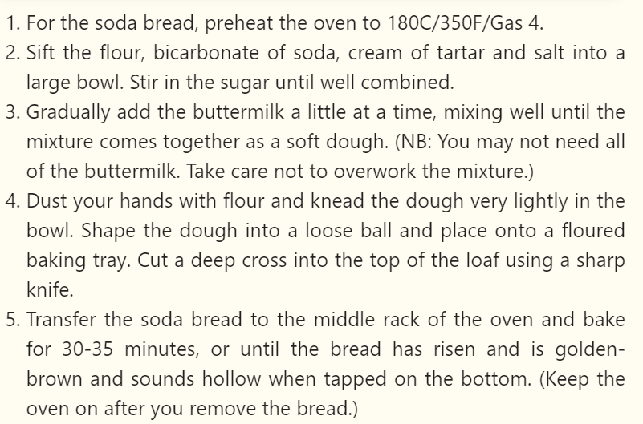

#### Icons

The icons used in this project are provided by [Font Awesome](https://fontawesome.com/).
All icons used were chosen for their obvious meaning and purpose so that they can be understood by everyone.

#### Colours

The color palette contains two dark, two-light, and one bright color. Combining these colors I got an eye-pleasing and interesting look.
- Color palette can be find [here](readme_files/color_palette/cook_book_colour_palette.png).

#### Styling

- Cards and container boxes were given rounded corners with shadows.
- Repeating the same rounded corner pattern throughout the page keeps     consistency in design and maintains the feeling that all elements       belong together.
- Pictures that accurately show the finished result of the recipes.
- All elements on the page have a shadow, which is the main shade of      black. Only the navbar has a different shade that is a little more      pronounced to get the effect of underlining the page when scrolling.
- All the buttons on the page are large and easy to use, with the         action name on each, so the user knows what to expect when a            particular button is pressed.
- Recipe cards and buttons share the same hover effect when a user        interacts with items by letting them know something is going on.
- For the text dividers, I used decorative dividends, which gave me the   look and style of the book that fits nicely with the Pacifico font      and gives me the design I had planned from the beginning.

### Wireframes

These wireframes were created using [Balsamiq](https://balsamiq.com/) during the Scope Plane part of the design and planning process for this project.

- Wireframes for this project can be found [here](/wireframes/cook_book_wireframes.pdf).
- Colored wireframes can be found [here](/wireframes/colored_wireframes/cook_book_wireframes_colored.pdf).

#### Entity Relationship Diagram

For creating ERD i used [**LucidChart**](https://lucid.app/) during the Scope Plane part of the design and planning process for this project.

- ERD can be found [here](readme_files/erd_diagram/cook-book-erd.png).

## Features

### Existing Features

#### Home Page

- The home page shows the four last added recipes in the database from each category allowing the user to immediately have an insight into the recipes that interest him.

- Home page with last four recipes added in database:

    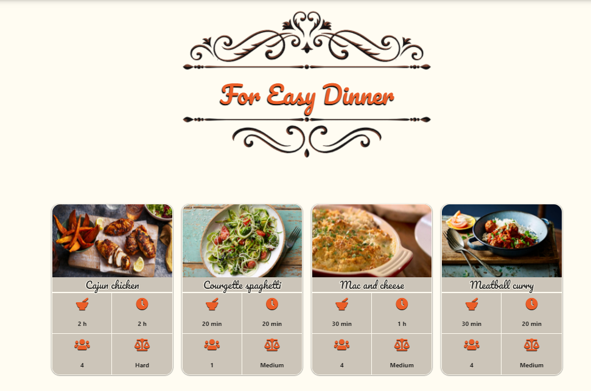

#### Navigation Bar

- The Navbar is fixed so it is always available to the user.
- Allows all users to select the content they want to view by simply clicking them, this also collapses into a toggle on mobile devices to.
- After the user registers, the navigation bar expands and gets two new items My Recipes and Add Recipe.

- Navigation Bar for all users:

    

- Navigation Bar for registered users:

    

- Navigation Bar on hover:

    

- Navigation Bar category hover:

    

#### Search Bar

- So the user can find recipes and filter them.
- The user can find the search bar on the home page and have the option to reset the search and start over again from the home page or start a new search immediately.
- Search bar provides the user with feedback if the recipe is found and if is not.

- If the search has a result: :

    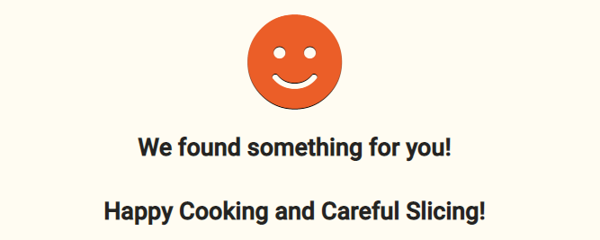

- If the search has no result:

    

#### Parallax 

- Parallax is used on the home page and on the recipe page. On the home page as a container for the hero image while on the recipe it was used as a background containing the recipe image. Blur on pallarax was added on the recipe page.

- Recipe parallax with blur :

    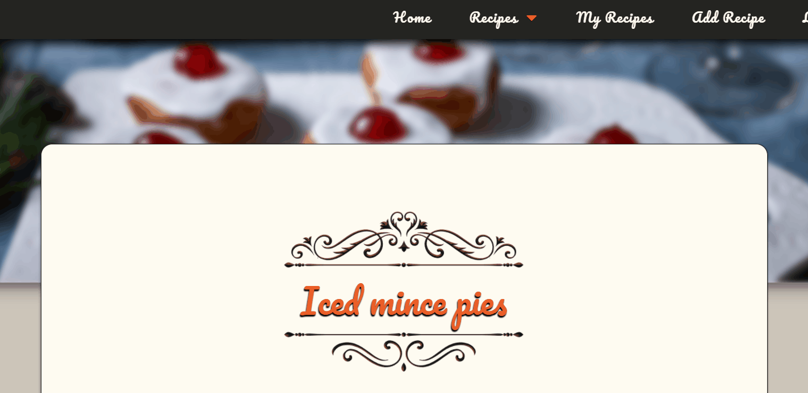

#### Floating Action Button 

- It allows the user to quickly scroll to the top of the page and also on the recipe page allows you to return to the home page. The floating button is located in the lower right corner of the screen and is located on all pages is especially useful on mobile devices.

- On the recipe page the user can choose, go back to the home page, to the top of the page or if the recipe is his he can edit it.

- Floating button to scroll on top :

    

- Floating button on recipe page :

    

#### Quick Log In

- Allow the user a quick login to his account directly from the home page.

- Login on home page with invite message :

    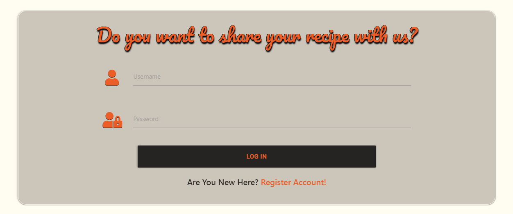

#### Recipe Cards

- Allow the user to see without searching and clicking the recipe they would like, also providing the user with more important information     about the recipe.

- Recipe card showing recipe preparation time, recipe cooking time,   recipe size and recipe difficulty :

    

- Recipe card on hover:

    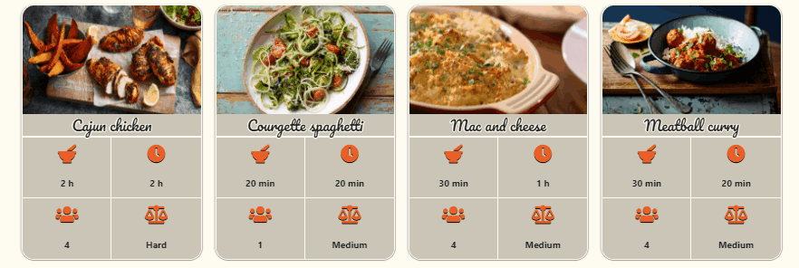

#### Log In / Register Page

- Allows a new user to create their account and allows existing users to log in to their account. 

- Allows user login/register without changing a page :

    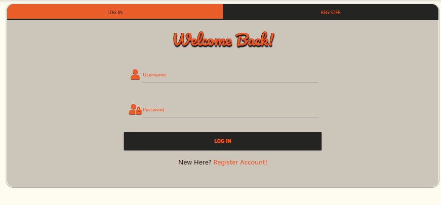

#### My Recipes

- Allows registered users to **view** previously added recipe.
- Allows registered users to **update** their recipe.
- Allows registered users to **delete** their recipe. 
- When a user decides to delete a recipe before deleting it, he is asked to confirm.

- My recipe cards with delete and edit button :

    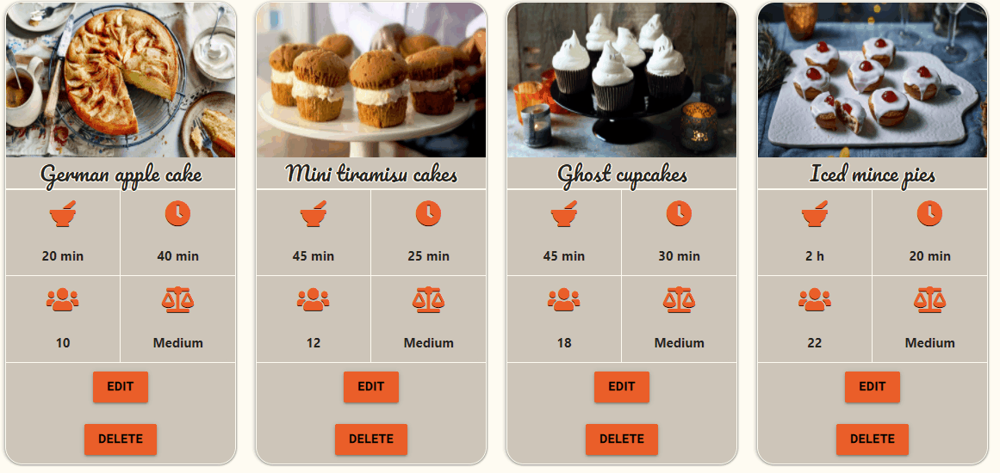

- Delete Modal :

    

#### Add Recipe

- Allows registered users to add their own recipes.

- When adding a recipe, the user should select the category and difficulty of the recipe from the drop-down menus, and enter other information about the recipe. Each input field has an info icon on the right explaining to the user what he should do when entering recipe information.

- Recipe category and difficulty :

    

- Input info position :

    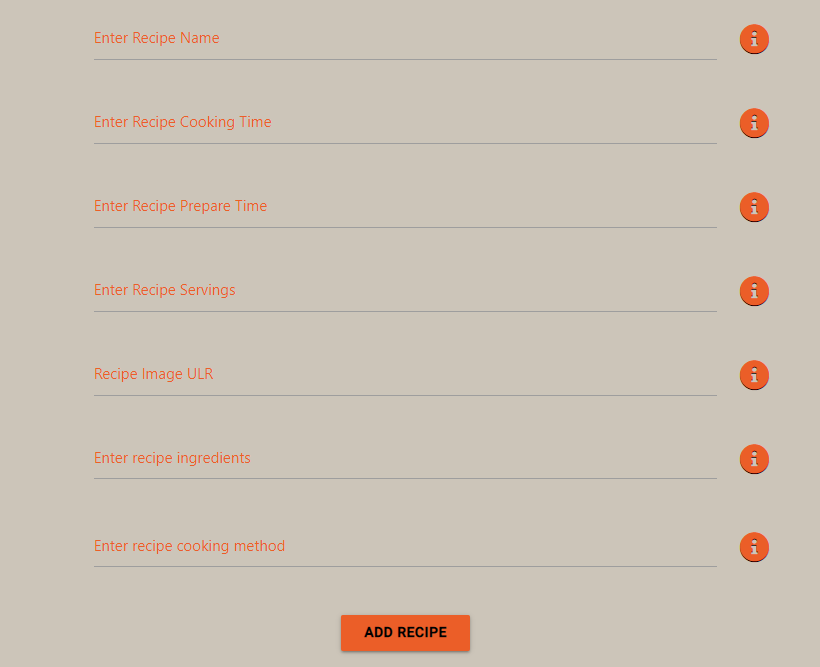

- Input requirements :

    

#### Footer 

- Contain autor name and social icons.

### Features Left to Implement

- I would like to add information about possible allergens in the recipe.

- A rating system that allows the user to rate a tried recipe. Over time, the homepage will no longer display the last four recipes, but the last four recipes with the highest score.

- Mail A welcome message when the user registers on the site, also when the rating system is in place to inform the user that the recipe has received a rating.

- A page for the administrator who would have the options to delete recipes and edit also a dashboard with page and recipe statistics.

- Features to share recipe.

- User account page with option to delete or update their account.

## Technologies Used
- [**HTML**](https://www.w3.org/TR/html52/)
    - standard markup language for creating Web pages.
- [**CSS**](https://www.w3.org/Style/CSS/Overview.en.html)
    - to describe and style HTML document such as layout, colors, font and animation.
- [**Github**](https://github.com/)
    - to store and share all project code remotely.
- [**Gitpod**](https://gitpod.io/)
    - used as development environment for building the application.
- [**MongoDB Atlas**](https://www.mongodb.com/cloud/atlas)
    - used for database storage
- [**Trello**](https://trello.com/)
    - to save and organize user stories.
- [**Monday.com**](https://monday.com/)
    - for organizing and planning the project and its phases.
- [**Google Fonts**](https://fonts.google.com/)
    - to style the website fonts.
- [**Font Awesome**](https://fontawesome.com/)
    - to provide fonts for this project.
- [**Materialize**](https://materializecss.com/index.html)
    - to simplify the structure of the website and make the website responsive easily.
- [**Balsamiq Wireframes**](https://balsamiq.com/wireframes/)
    - to create the wireframes and planning this project.
- [**Photoshop**](https://www.adobe.com/ie/products/photoshop.html)
    - to edit, crop and save images as well as logo creator.
- [**Dev Tools**](https://developers.google.com/web/tools/chrome-devtools)
    - to keep track and test the code during the development.
- [**Tinypng**](https://tinypng.com/)
    - to compress the size of the images.
- [**Coolors**](https://coolors.co/)
    - used to choose color pattern.
- [**JQuery**](https://jquery.com/)
    - to simplify DOM manipulation and **Materialize** initalization.
- [**Flask**](https://flask.palletsprojects.com/en/1.0.x/)
    - to construct and render pages.
- [**Jinja**](https://jinja.palletsprojects.com/en/2.10.x/)
    - to simplify displaying data from the backend of this project smoothly and effectively in html.
- [**PIP**](https://pip.pypa.io/en/stable/installing/)
    - for installation of tools needed in this project.
- [**PyMongo**](https://pymongo.readthedocs.io/en/stable/)
    - to make communication between Python and MongoDB possible.
- [**Favicon.io**](https://favicon.io/favicon-converter/)
    - to create Favicon.
- [**LucidChart**](https://lucid.app/)
    - to create ERD (Entity Relationship Diagram)

## Testing

- Testing information can be found in separate [testing.md](testing.md) file.

## Deployment

    - Clone a Repository from Github
    - Work with a Local Copy
    - Deploy on Heroku

### Cloning the Repository

To work with a local copy of this project the following steps needs to be taken:

- Go to the main page of the GitHub repository and click on the dropdown menu **Code**

- Copy the URL and go to your local IDE

- In the terminal of your IDE type in **git clone** and the paste the URL copied 
- Press Enter and the clone will be created

### Working with a Local Copy

Installing the Requirements :

- To install all the required libraries of the project go to the workspace of your local copy

- In the terminal window of your IDE type in: **pip3 install -r requirements.txt**

Creating Collections in MongoDB :

- Login to your MongoDB account
- Create a **cluster**
- Create a **database**
- Create four **collections** in the database named:

    - **categories**
    - **difficulty**
    - **recipes**
    - **users**

Setting Up the Environment Variables :

- Create a file called **.gitignore** in the root directory of your project
- Add the following text in your .gitignore file: **env.py**
- Create a file called **env.py**. This will contain all your environment variables
- Create your own personal secret key and password.

Run the App :

- Open your terminal window in your IDE

- Type in **python3 app.py** to run the app

### Heroku Deployment

To host this project on Heroku :

Setting Up Heroku

- Create a Heroku account

- Create a new app and select your region

Preparing Local Workspace for Heroku

- In the terminal window of your local IDE type **pip3 freeze --local > requirements.txt** to create a requirements.txt file. This file is needed so that Heroku knows which files needs to be installed

- In the terminal window of your local IDE type **python app.py > Procfile** to create a Procfile. This file is needed so that Heroku knows which file is needed as its entry point to get the app up and running

Pushing files to Heroku

- In the terminal window of your local IDE type in **heroku login** or **heroku login -i** and fill in your heroku credentials and password

- Commit all your files and type in the same terminal window **git push heroku master**. Now all your files are committed to Heroku

Setting the Configuration Variables in Heroku

- Go back to your Heroku account and go to **settings**

- Click on **Reveal Config Vars** to reveal the keys and the values

- Set the keys and values as follow:

    (**KEY: VALUE**)
    - IP: 0.0.0.0
    - PORT: 5000
    - MONGO_DBNAME: YOUR-DATABASE-NAME
    - MONGO_URI: mongodb+srv://root:**YOURPASSWORD**@**YOUR-CLUSTER-NAME**.2qobt.mongodb.net/**YOUR-DATABASE-NAME**?retryWrites=true&w=majority
    - SECRET_KEY: YOURSECRETKEY

Open App in Heroku

- Click on **Open app** in the right corner of your Heroku account, the application will open in a new window

- The live link is available from the address bar

## Credit

### Content

- Home page parallax image is taken from [here](https://www.usa.canon.com/internet/portal/us/home/learn/education/topics/article/2019/june/top-tips-for-better-food-photos-on-social-media/top-tips-for-better-food-photos-on-social-media/!ut/p/z1/lZJLU9swFIX_Slmw1OjaethaOs7LxWkwEAjeZGRbCmISKTgidPj1NTTTTunEtNro9d1zNUcHl3iJSysPZi29cVZuuv19yVezYhpPsxRyGOYCivl8MByP04wmFN-9A3BiJIDLf6nvAcp--Z_1cRaPpgLCPL6MORQwEjlZZNl8QT_r__UzoHMgbGfpbI3LnfQPyFjt8DKEQODl47NVeOndDnmz2yPtWlQp71XbLV2Ddg_Ouz1yFu1dbeQGbVVj5P8X3OGy95UX_BNgQo_AL5_m-SSCJEopXN0kwWTB_lK4HVBIuBimJBy_eX0E-n76g8KV6FrwIZ-KbwOYzoN-oMh4P5CNKL7vfjv6Dcy7eyguJkVyO7qALArw3cGoF7ywrt126b1-U9zVpsH3IoBKgYiRlk2AKGk4inlAUCVDQSPNqIgFnsKxw8k8sdMdaiKCRlcSsUoDoizQqIpDiriOFAFNoWb6GLeeuHZxM49PT2WCy9pZr757vKyldXZl1cuLqlbvp9afQ2PWxsvNaqNka41dn4M6dBdfjN379rn2rt2fw8a8SrRW7f5hK-2JLP_JfDAAbgvWJSkfhARuAhiGpw1QFWNRozQi0LDOYs07AyigOpK6ViSUlQ4_yk_SbAhFQq7GeXI9oZf8tDzhnPG6EigSIUFURhSJmoVIURKCEgGjtcS77WKxfM0TfZ2ZzFxu0yqejQjbHHL9Nq-3ydnZD76Kwfw!/)

- All credit for image go to autor.

- All recipes is taken from [BBC Food](https://www.bbc.co.uk/food)

- Decorative divider is taken from [Vecteezy](https://www.vecteezy.com/vector-art/216053-decorative-ornaments-vector). All credit go to autor.

- Box shadow and animation are taken from [Material Design Box Shadows](https://codepen.io/sdthornton/pen/wBZdXq).

#### Recipes
- Here is all links to recipes included in page :

https://www.bbc.co.uk/food/recipes/eggy_bread_11076

https://www.bbc.co.uk/food/recipes/theulsterfry_92143

https://www.bbc.co.uk/food/recipes/drop_scones_38257

https://www.bbc.co.uk/food/recipes/belgian_waffles_34066

https://www.bbc.co.uk/food/recipes/hashbrowns_12454

https://www.bbc.co.uk/food/recipes/honey_chicken_39457

https://www.bbc.co.uk/food/recipes/halloumi_salad_19294

https://www.bbc.co.uk/food/recipes/pasta_frittata_31803

https://www.bbc.co.uk/food/recipes/meatball_curry_51206

https://www.bbc.co.uk/food/recipes/glam_mac_and_cheese_92848

https://www.bbc.co.uk/food/recipes/tomato_and_broccoli_08254

https://www.bbc.co.uk/food/recipes/cajun_chicken_wedges_61950

https://www.bbc.co.uk/food/recipes/halloween_ghost_cupcakes_04170

https://www.bbc.co.uk/food/recipes/iced_mince_pies_04100

https://www.bbc.co.uk/food/recipes/mini-tiramisu_cakes_73687

### Acknowledgements

- To my girlfriend who was my biggest helper, the biggest critic, the voice of common sense in some difficult moments during the making of this project.

- I'd like to thank my mentor in Code Institute **[Precious Ijege](https://www.linkedin.com/in/precious-ijege-908a00168/)** who had all the patience to explain and make me understand certain concepts and peculiarities of the project. And also for useful and constructive feedback through this project.

- All people, including family, friends, and colleagues who have tested the application on their real devices, reporting to me about any usability issues and giving improvement tips to improve the usability.

- To all of the **[Code Institute Slack](https://codeinstitute.net/)** community for the help in my issues and review to my project.

### The content of this website is for educational purposes only. 